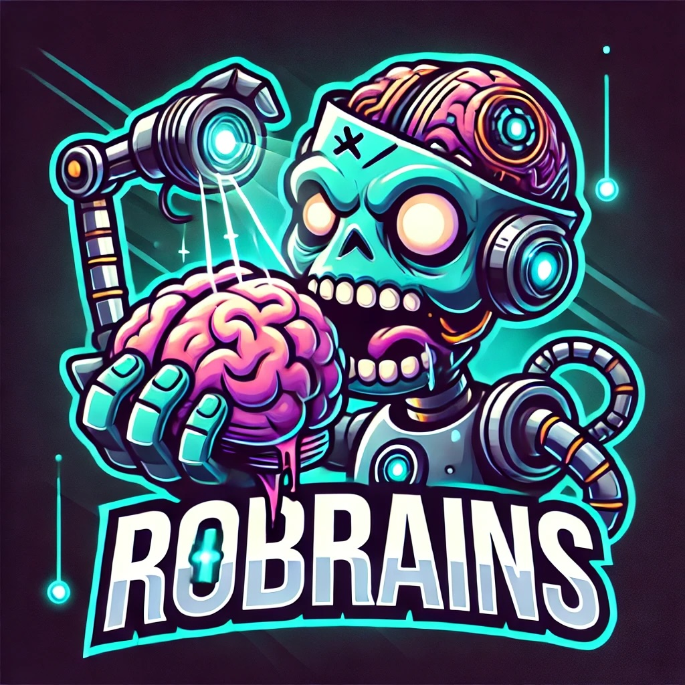

#  RoBrains

> ***"You are not special, You are not a beautiful or an unique  snowflake"***  
> — *Tyler Durden (Figth Club)*

---

## Overview

**RoBrains** is the unified Machine Learning backend for projects such as **RoboChem**, **RobERTA**, **Omni-RoboChem**, and other group projects. Instead of maintaining separate environments for each project, RoBrains provides a modular and flexible architecture, allowing you to build and deploy your ML strategies quickly and consistently.

By encapsulating common ML and communication functionalities, RoBrains ensures that you only need to maintain a single package that seamlessly integrates with all your experimental workflows.

---

## Table of Contents

- [Why RoBrains?](#why-robrains)
- [Key Modules](#key-modules)
  - [Communication Modules](#communication-modules)
  - [ML Modules](#ml-modules)
- [Installation and Setup](#installation-and-setup)
  - [Required Software](#required-software)
  - [Environment Setup](#environment-setup)
- [Usage](#usage)
  - [Initializing a New ML Experiment](#initializing-a-new-ml-experiment)
  - [Running Your Experiment](#running-your-experiment)
- [Architecture](#architecture)
- [Directory Structure](#directory-structure)
- [Contributing](#contributing)
- [License](#license)
- [Acknowledgements](#acknowledgements)
- [Author](#author)

---

## Why RoBrains?

Managing separate repositories for projects with overlapping ML environments is inefficient and error-prone. **RoBrains** was created to:
- **Unify** ML development across projects.
- **Simplify** maintenance by offering a single, modular package.
- **Accelerate** research by reusing tested components for experiment control and optimization.

---

## Key Modules

### Communication Modules

These modules handle how your ML backend communicates with the hardware or experimental platform:

- **BaseMLBackend**: The base class for all ML communications.
- **ML_Assistant**: Supports single-threaded operations for RobERTA.
- **ML_Platform**: Implements multi-threaded operations for Omni-RoboChem where analytics are performed inline.
- **ML_Platform_HITL**: Integrates HUMAN-IN-THE-LOOP for scenarios where a human must review results before the next steps.
- **ML_Platform_HITL_Development**: Designed for manual experiment condition suggestion and development tasks—no ML is applied here.

### ML Modules

These modules contain various ML strategies that can be employed to optimize your experiments:

- **SingleBayesianOptiBackend**: Single-task Bayesian optimization (single or multi-objective) using BOTORCH.
- **HighCategoricalEmbeddings**: Efficient screening in high-dimensional categorical spaces via vector embedding.
- **DOEBackend**: (Error not implemented yet) Intended for Design of Experiments strategies.
- **KIEBackend**: (Error not implemented yet) Planned module for kinetic or informational extraction.
- **ScopeAcceleratorFidelity**: Multi-fidelity Bayesian optimization for chemical transfer learning.
- **ScopeAcceleratorTask**: Multi-task Bayesian optimization for chemical transfer learning.
- **AllScopeTasks**: Optimizes an entire scope table simultaneously using multitask learning.
- **DevelopmentHITL**: Used during development to handle manual experiment requests.

For specific parameters required by each sub-module please look at the submodule docstrings

---


### Required Software

Before installing, ensure you have the following:

- **Python 3.12+** – [Download Python](https://www.python.org/downloads/)
- **Conda** – Recommended for environment management ([Download Anaconda](https://www.anaconda.com/download))
- **Git** – For version control ([Download Git](https://git-scm.com/downloads))
- A preferred **Python IDE** (e.g., [PyCharm Community Edition](https://www.jetbrains.com/pycharm/download/?section=windows))

*Using Conda helps manage dependencies across various projects efficiently, while Git facilitates tracking changes.*

### Environment Setup

Clone the repository, navigate to the project root, and create the environment using:

```bash
conda env create -f RoBrains_env.yml
conda activate RoBrains_env
```
### Usage
#### Initializing a New ML Experiment

To integrate RoBrains in your project, first create a child class that inherits from both a communication module and an ML module. For example:

```python
from ML_modules import SingleBayesianOptiBackend
from Communication_modules import ML_Assistant

class ChildClass(SingleBayesianOptiBackend, ML_Assistant):
    def __init__(self):
        super().__init__()
```
Then, initialize the ML and communication settings:

```python
# Initialize ML and Communication settings
ML_instance = ChildClass()
ML_instance.ML_prime(
    ml_parameters=list_of_ML_parameters, 
    targets=list_of_targets,
    path=path_to_session_files
)
ML_instance.comm_prime(kwargs)

# Update any additional parameters
for key, value in additional_parameters.items():
    ML_instance.validate_and_update(key, value)
```
#### Running Your Experiment

Once everything is set up, run your experiment using:
```python
# Initial run setup
ML_instance.first_run()

# Main loop execution (for continuous operation or iterative testing)
ML_instance.run()
```
## Implementating this in your project
1. Fork this repository.
2. Clone your fork as a submodule in your project.
```bash
git submodule add <your_forked_repo_url> RoBrains
git submodule update --init --recursive
```
3. pull main branch of RoBrains to get the latest updates.
4. pip install as editable
```bash
pip install -e RoBrains
```
5. Import the required modules in your project.
```python
from robrains import ML_modules, Communication_modules
```

## Repository Structure
```plaintext
robrains
├── __init__.py
├── base_classes
│   ├── __init__.py
│   ├── base_classes.py
│   └── logger.py
├── communication_module
│   ├── __init__.py
│   ├── communication_module.py
│   ├── ml_assistant.py
│   ├── ml_platform.py
│   ├── ml_platform_hitl.py
│   ├── ml_platform_hitl_development.py
│   └── ml_platform_robochem_one.py
├── custom_acquisition
│   ├── __init__.py
│   ├── learnedconstraintsacquisition.py
│   └── maxvariance.py
├── custom_models
│   ├── __init__.py
│   ├── bayesianlinearregressionsurrogate.py
│   ├── bayesianneuralnetworksurrogate.py
│   ├── custom_models.py
│   ├── logisticregressormodel.py
│   ├── multioutputsurrogate.py
│   ├── neuralnetworksurrogate.py
│   ├── randomforestsurrogate.py
│   └── svrsurrogate.py
├── ml_modules
│   ├── __init__.py
│   ├── allscopetaskbackend.py
│   ├── developmenthitl.py
│   ├── efficientbatchedbobackend.py
│   ├── highcategoricalembeddings.py
│   ├── scopeacceleratorfidelitybackend.py
│   ├── scopeacceleratortaskbackend.py
│   └── singlebayesianoptibackend.py
├── parameter_backends
│   ├── __init__.py
│   ├── analyparameter.py
│   ├── chemical.py
│   ├── expparameter.py
│   ├── mlparameter.py
│   ├── physicalparameter.py
│   ├── stocksolutiondf.py
│   └── vialdf.py
├── session_management
│   ├── __init__.py
│   └── session_management.py
└── utils.py


```

## Contributing
Do pull requests from your fork

## Acknowledgements
RoBrains is maintained and developed by the Noel Research Group behind RoboChem, RobERTA, Omni-RoboChem, and other related projects. Our thanks to everyone who has contributed to the development and testing of this package.

## Author and Contributors
**Elia Savino**: e.savino@uva.nl (2025) [Lead Developer/Owner]
