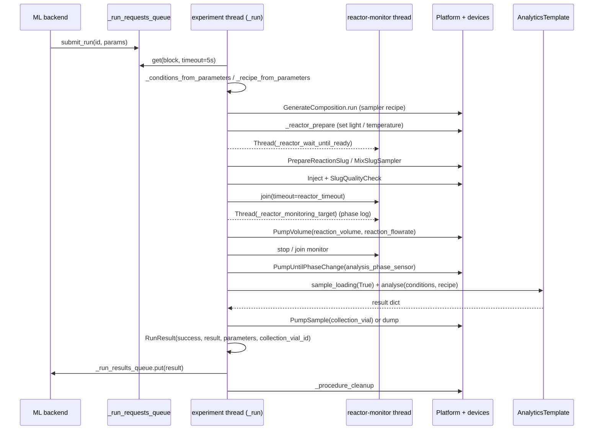

# 04 — Experiment Orchestration Lifecycle

This report documents the experiment-orchestration layer of `robochem_flex`, the module that converts a stream of ML-proposed conditions into physical reactor runs and feeds results back. All code lives under `Control Software/OmniPlatypus/OmniPlatypus/omniplatypus/procedures/experiments/`.

## 1. The `BaseExperiment` contract

`BaseExperiment` (`base_experiment.py:85`) is an `ABC` that models an experiment as a long-lived, thread-based service. Subclasses implement five hook methods; the base class owns the event loop, queues, error classification, and the pairing with an analytical method.

Five lifecycle phases are defined:

1. **`__init__`** (`base_experiment.py:173-215`) validates the requested `analytical_method` against `cls._analytical_methods`, binds an `ExperimentAnalysisCoupler`, checks for duplicate parameter names (`check_duplicate_parameters`, line 217), and builds the public thread interface: five `queue.Queue` objects, a `_stop_event`, a `_resume_event`, and an unstarted `_experiment_thread`. The `Platform` instance is created here but not yet built.
2. **`start` / validate**: `start` (`base_experiment.py:245`) accepts a platform name, a `samples` DataFrame (the vial rack), optional platform-build arguments and constants overrides, and a `queue_update_interval` (default 5 s — the maximum latency between submissions and execution). It raises `RuntimeError` if a previous thread is still alive and launches `Thread(target=self._run, …, daemon=False)`.
3. **`_procedure_build`** (`base_experiment.py:638-667`) is the one-shot "prime" phase on the experiment thread: it calls `self._platform.build(**args)`, merges `platform_config.json` constants with any overrides via `_merge_platform_constants`, and instantiates `self._analytical_method` from `ExperimentAnalysisCoupler.analysis_class`, attaching the analytical device from the platform.
4. **`_procedure_prepare`** is an abstract (`base_experiment.py:679`) "clean + check" run before the first iteration. `ChemicalReaction._procedure_prepare` (`chemistry.py:323`) connects the injection port, primes both syringe pumps in parallel via `run_all`, and triggers `_procedure_cleanup` if the constant `cleaning.clean_on_start` is true.
5. **`_procedure_cleanup`** (`base_experiment.py:711`) runs after *every* iteration; `_procedure_shutdown` (`base_experiment.py:720`) runs once inside the `finally` of `_run`, calling `self._platform.clear()` to power down devices.

`submit_run` (line 442) first calls `check_run_parameters` (line 355), which rejects missing required parameters, unknown extra parameters, and parameters of the wrong subtype — catching errors *before* any pumps move.

## 2. Threading and queueing

The orchestration layer is a single-producer / single-consumer model wrapped around one experiment thread. Five queues are the only allowed cross-thread communication (`base_experiment.py:199-203`):

| Queue | Direction | Purpose |
|---|---|---|
| `_run_requests_queue` | public → thread | new `{"ID", "parameters"}` dicts from `submit_run` |
| `_run_results_queue` | thread → public | `RunResult` objects retrievable via `get_result` |
| `_user_action_queue` | thread → public | `UserActionRequest`s emitted when a platform/unit task needs human help |
| `_action_request_queue` | public → thread | `UserAction` resolutions from the GUI |
| `_samples_queue` | thread → public | snapshots of the vial-rack DataFrame |

Two `threading.Event`s drive flow control: `_stop_event` (shutdown) and `_resume_event` (pause/resume). The public `pause()` (line 307) flushes the samples queue, clears `_resume_event`, and blocks on `_samples_queue.get()`; the thread, on seeing a cleared resume-event, pushes a samples snapshot and waits (see `_run` below). `stop()` (line 336) additionally sets `_stop_event` and joins the thread.

The main thread body, `_run` (`base_experiment.py:761-874`), wraps everything in a `while not self._stop_event.is_set() and restart_platform:` outer loop, a `try / finally` that *always* calls `_procedure_shutdown`, and an inner run-consumer loop:

```python
while not self._stop_event.is_set():
    self._process_user_actions()
    if not self._resume_event.is_set():
        self._resume_event.wait(self._queue_update_interval)
        continue
    try:
        run_request = self._run_requests_queue.get(
            block=True, timeout=self._queue_update_interval)
    except Empty:
        continue
    # … process run …
```
(`base_experiment.py:792-806`)

Concurrency inside a single iteration is used for three things: (a) running pump priming and slug-preparation steps in parallel via `run_all(*threads)` (see `chemistry.py:330-333, 1173-1180`); (b) background monitoring threads (reactor phase monitor, light-current monitor, temperature monitor); (c) user-action pumps handled by `_wait_for_user_action` (line 589), where the experiment thread blocks on `self._stop_event.wait(interval)` and polls `_process_user_actions` until the GUI resolves the issue or `stop()` is called.

Cancellation is cooperative: `stop()` calls `flush_queue(self._samples_queue)` then `self._stop_event.set()`. The long-blocking queues all use `timeout=self._queue_update_interval`, so the loop notices the stop event within ~5 s. A stop does *not* kill a running iteration — it lets the current slug finish, then falls out of the loop into `_procedure_shutdown`.

## 3. One iteration end-to-end

`_run_procedure_experiment` (`base_experiment.py:727-759`) brackets a single iteration:

```python
run_result = RunResult(run_id)
conditions = self._conditions_from_parameters(parameters)
recipe = self._recipe_from_parameters(parameters)
try:
    self._procedure_experiment(run_result, conditions, recipe)
except Exception as error:
    run_result.exception = error
    run_result.success = False
finally:
    self._update_parameters(parameters, conditions, recipe)
    run_result.parameters = parameters
    return run_result
```

`_conditions_from_parameters` (line 876) filters out `ChemicalParameter`s and fills in defaults from `_optional_parameters`. `_recipe_from_parameters` (line 902) takes the chemical parameters and builds a `list[RecipeComponent]`; it enforces the rule that *exactly one* chemical is given as an absolute concentration (the limiting reagent) and the rest as equivalents, or that *all* are concentrations. Equivalents are multiplied by the limiting concentration on line 954. Finally `_update_parameters` (line 981) back-writes any values modified in-flight (e.g. rounded light intensity, measured residence time) into the parameter list so the ML sees the *actual* executed values.

A sequence diagram of one iteration on `PhotochemicalReaction` with an NMR analytical coupling:



## 4. Reaction subclasses

All three subclasses override only the "reactor" hooks — the slug-preparation / injection / analysis / cleanup flow in `ChemicalReaction._procedure_experiment` is shared.

**`ChemicalReaction`** (`chemistry.py:72`) is the heavy lifter. Its `_procedure_experiment` (line 478) does, in order: parameter coercion and constant lookup (sampling/reaction/analysis sections of `_platform_constants`), flowrate calculation `reaction_flowrate = reactor_volume / residence_time` (line 557), slug composition via `GenerateComposition.run`, background `_reactor_wait_until_ready` thread, slug preparation (`PrepareReactionSlug`, `MixSlugSampler`), injection (`Inject.run`), slug-quality check (with `BadSlugQualityError` vs `CloggingError` distinction at line 908-918), the timed reaction pump (`PumpVolume(reaction_volume, reaction_flowrate)`, line 940), reactor-output phase monitoring, optional slug verification (`_move_slug_and_verify`, line 436), optional analytical device loading and `self._analytical_method.analyse(conditions, recipe)` (line 1022), and either collection into a vial or dump to waste. It defines five supported analytical couplings — `Human`, `NMR`, `NMR_dummy`, `UPLC`, `Raman` — in `_analytical_methods` at line 97.

**`PhotochemicalReaction`** (`photochemistry.py:51`) adds one required parameter (`light_intensity`, quantised to 25 % steps), one device (`Light_Array`), and overrides the three reactor hooks: `_reactor_prepare` sets light via `SetLightSourceIntensity.run` (line 125), `_reactor_standby` turns it off (line 150), `_reactor_wait_until_ready` is a no-op (light response is effectively instant). Its `_procedure_build` additionally starts a `ContinuousMonitoring` thread on the light array's `current` parameter (30 s update; line 104-109) and its `_procedure_shutdown` stops that thread via `self._stop_monitoring.set()`.

**`ThermochemicalReaction`** (`thermochemistry.py:29`) adds `temperature` (required) and `stirring` (optional), requires `heating_plate_IKA`, and optionally binds a cooling `Fan`. `_reactor_prepare` calls `SetReactorTemperature.run` (line 117). `_reactor_wait_until_slug_can_be_prepared` (line 121) gates slug preparation so that a prepared slug never sits waiting on a cold/hot reactor: if current temperature is >5 °C over target it kicks the fan; if >20 °C under it blocks. `_reactor_wait_until_ready` calls `CheckReactorTemperature.run(..., stability_duration=30.0, tolerance=2.5)`. `_reactor_standby` sets target to 0 and turns the fan on. Temperature is continuously monitored via `ContinuousMonitoring` on `actual_sensor_temperature` (line 96).

## 5. `ExperimentAnalysisCoupler`

`ExperimentAnalysisCoupler` (`base_experiment.py:52-82`) is a plain record with three fields: `analysis_class` (a `Type[AnalyticsTemplate]` such as `NMRAnalysis`, `HPLCAnalysis`, `AnalyticsRaman`, `DummyNMRAnalysis`, or `None` for human analysis), `analytical_device` (the device name in `platform_config.json` to be passed to the analysis constructor), and `platform_constants_key` (the sub-key under `constants.analysis` where volumes and offsets for that coupling live). Each experiment class exposes a dict `_analytical_methods: dict[str, ExperimentAnalysisCoupler]`. The user picks one by name at `__init__`, `_procedure_build` instantiates `analysis_class(analytical_device=…, processing_method=None, storage_root=…)` (`base_experiment.py:663`), and per-iteration the analysis plugs in via `self._analytical_method.sample_loading(enable=…)` and `self._analytical_method.analyse(conditions, recipe)` (`chemistry.py:1013-1027`).

## 6. `RunResult`

`RunResult` (`experiment_parameters.py:222-267`) is the entire payload returned to the ML backend:

```python
class RunResult:
    run_id: str
    result: Any                                  # dict returned by analyse()
    success: bool                                # True only if full flow reached end
    parameters: list[ExperimentalParameter]      # *actual* executed values
    collection_vial_id: str | None
    exception: Exception | None
```

`success` is set to `True` only on the last line of `_procedure_experiment` (`chemistry.py:1099-1106`); if the analysis dict contains a `"pass"` key that overrides it. `parameters` are back-written via `_update_parameters` so measured fields (`measured_slug_volume`, `measured_residence_time`) end up in the result. The convenience `get_param_by_name` (line 252) lets the ML frontend pull one parameter by name; each returned parameter is a deepcopy.

## 7. Error handling and recovery

Errors are captured inside `_run_procedure_experiment`'s `try/except Exception` block and stuffed into `run_result.exception` — the running iteration always returns a result. The outer `_run` loop (`base_experiment.py:828-862`) then classifies the exception:

- `BadSlugQualityError`, `ValueError`: swallow, keep running, continue with the next submitted run.
- `DeviceCommunicationError`, `DeviceTimeoutError`, `ParameterCommError`, `ParameterTimeoutError`, `ParameterAcknowledgeError`, `ParameterNotRunningError`, `SoftLimitError`, `HardLimitError`, `AlarmLockError`: set `restart_platform = True` and `break` out of the inner loop — the outer loop then rebuilds the platform (`_procedure_build` + `_procedure_prepare`) and resumes processing the queue.
- Anything else: log and re-raise from `_run`, which unwinds to `_procedure_shutdown` via the `finally`.

Per-iteration, `_procedure_cleanup` still runs after a failed run (note the inner `else` branch calls cleanup only on success; on device errors the break skips cleanup but `_procedure_build` on restart will re-prepare). The `BadSlugQualityError`-vs-`CloggingError` split at `chemistry.py:908-918` shows finer granularity: <=1 phase change implies a clogged line (raised as `CloggingError` which *does* restart the platform), otherwise a slug failure (retryable without restart, with `_discard_slug=True` triggering a lighter cleanup variant). User-resolvable conditions (missing vials, exhausted reagents) go through `_wait_for_user_action` (line 589), which blocks the run indefinitely — the ML sees only that the result takes longer, not that an error occurred — until `UserSetSamples` arrives via `submit_user_action`.

The net effect: the ML backend submits a run, waits on `get_result(timeout=…)`, and receives a `RunResult` whose `.success` / `.exception` fields tell it how to score the proposal. The platform keeps churning until `stop()` is called, self-healing through device glitches and surfacing only genuinely unrecoverable faults.
