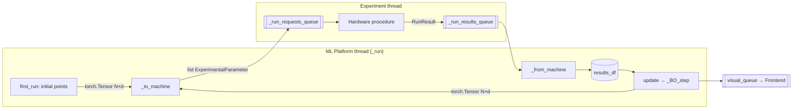

# 05 — ML ↔ Hardware Closed Loop

This report traces the data path that lets RoboChem's Bayesian optimizer steer a physical reactor. It covers how a proposed experimental point is conjured from a Gaussian‑Process posterior, how it gets serialized into a concrete hardware recipe (vials, concentrations, volumes, temperatures), how the hardware hands back a `RunResult`, and how that result is folded back into the training set for the next iteration. All citations are to files in `Control Software/`.

## 1. Architecture: Producer/Consumer Queues

The ML side and the experiment side run in **separate threads** and communicate only through `queue.Queue` objects. On the experiment side (`OmniPlatypus/omniplatypus/procedures/experiments/base_experiment.py:199-204`) the `BaseExperiment` owns four thread‑safe queues:

```python
self._run_requests_queue = Queue()   # ML → hardware (recipes)
self._run_results_queue  = Queue()   # hardware → ML (RunResult)
self._user_action_queue  = Queue()
self._samples_queue      = Queue()
```

The experiment thread pulls from `_run_requests_queue` via `submit_run()` (line 442) and pushes `RunResult` objects to `_run_results_queue`, consumed by the ML side through `get_result()` (line 467).

On the ML side, `ML_Platform.com_prime()` (`ml_platform.py:211-228`) creates the **control-plane queues**:

```python
self.visual_queue = Queue()     # results_df snapshots for the frontend
self.HITL_queue   = Queue()     # frontend → ML (human-in-the-loop)
self._stop_event  = Event()
self.experiment   = kwargs.get("experiment", None)
```

The handshake is intentionally narrow: the ML side never touches hardware objects and the experiment never touches `torch` tensors. Everything crossing the boundary is a typed Python object (`list[ExperimentalParameter]` going out, `RunResult` coming in).



## 2. `ML_Platform.run()` Step by Step

`run()` (`ml_platform.py:35-67`) bootstraps the loop. It first synchronously invokes `first_run()` (supplied by the specific optimizer backend) and then spawns a daemon `Thread` pointing at `_run`:

```python
self.first_run()
...
self._running_thread = Thread(target=self._run, name=thread_name)
self._running_thread.daemon = True
self._running_thread.start()
```

### 2.1 Priming (`first_run`)

For `SingleBayesianOptiBackend` (`singlebayesianoptibackend.py:469-549`), `first_run()` samples an initial design:

1. If a `results_df` already exists from a prior session, it subtracts already‑finished runs from `"Number of initial points"` and resumes (lines 508-536).
2. Otherwise, `initialise_parameter(...)` draws `extra_points` samples, honoring `"Initialisation Method"` (LHS or Random) and `"force_categorical"`.
3. The resulting tensor `self.initial_x` is passed to `self.out_data(self.initial_x)` which calls `_to_machine` per row and submits each to the hardware queue.

### 2.2 Main Loop (`_run`)

`_run` (`ml_platform.py:119-182`) polls the experiment queue and reacts as results arrive:

```python
while not self._stop_event.is_set():
    data = self.experiment.get_result(block=False)
    if data is None:
        self._stop_event.wait(1)
        continue
    run_index, x, y, y_var, vial_idx, save_file_name = self._from_machine(data)
    self.in_data(run_index, x, y, y_var, vial_idx)
    self.visual_queue.put(self.results_df.copy())
    if self.check_batch(run_index, x, y, vial_idx):
        self.update()
```

`check_batch` (`ml_platform.py:196-209`) returns `True` only when no row in `results_df` still has `status == "submitted"` — i.e. the batch is drained. Only then is `update()` invoked and a new batch proposed.

### 2.3 Refitting (`update` → `_BO_step`)

`update()` (`singlebayesianoptibackend.py:671-734`) orchestrates one full BO iteration:

1. `_process_data()` re‑materialises `train_x`, `train_y`, `train_y_var` from the DataFrame via `_from_df`.
2. If retries are pending it short‑circuits: `self.out_data("failures")`.
3. `_check_adaptive()` optionally tunes exploration factors based on the last 3 targets.
4. `train_y` is normalized with `ColumnNormalizer` (mins/ranges, `utils.py:663-688`).
5. The termination criterion (`max_iter`) can emit `self.out_data("stop")`.
6. `_BO_step()` fits the surrogate, optimizes the acquisition, and emits next points via `out_data(next_point, predicted_y=...)`.

## 3. `ToandFromMachine`: Tensor ↔ Recipe

`ToandFromMachine` (`Control Software/backend/ml_backends.py`) is mixed in with the platform backends (line 838 onward) because this translation is OmniPlatypus‑specific. It owns two key methods.

### 3.1 `_to_machine(tensor)` — Tensor → Recipe

For each `MLParameter` in `self.ML_parameters`, it looks up the parameter's slot in `self.check_dict` (populated by `_generate_check_dict`, `communication_module.py:995-1155`) and back‑translates:

```python
if f"{param_name}_continuous" in self.check_dict:
    tensor_continuous_value = tensor[self.check_dict[f"{param_name}_continuous"]]
    value_continuous = parameter.back_translation_continuous(
        tensor_continuous_value.item()
    )
```

`back_translation_continuous` maps `[0,1] → [min,max]` in natural units (e.g. mM, °C). Discrete slots are decoded via `back_translation_discrete`, task slots via `back_translation_task`, and multi‑fidelity slots via `back_translation_fidelity` (`ml_backends.py:110-143`; translators are generated in `mlparameter.py:544-681`).

Each parameter becomes either a `ChemicalParameter` (chemical identity + concentration, lines 148-157) or a `NumericalParameter`/`ExperimentalParameter` (lines 158-180) and is tagged with a `foreign_key` that remembers which ML parameter it came from — this is the label used to reverse the translation later.

Constants from `self.constants` (catalyst stock, solvent, analytical peaks, etc.) are appended unchanged (`ml_backends.py:186-257`), including special handling for `yield_calculation_chemical`, `target_peak` and `retention_time` which are looked up in a pandas DataFrame keyed by the chosen limiting reagent (lines 199-217).

The platform‑specific machinery (NMR pulse programs, HPLC tables, sample identifiers) is copied in from `self.parameter_machine`; the `sample_name` machine gets a run‑unique stamp:

```python
case "sample_name":
    to_append = copy.deepcopy(machine)
    name = f'run{self.run_index}_{time.strftime("%Y%m%d%H%M%S", time.localtime())}'
    to_append.value = to_append.value(name)
```

A sampling priority from `_sampling_priorities` (`ml_backends.py:53-73`) is attached to chemicals so the liquid‑handler dispatcher knows which reagent defines the slug.

### 3.2 `_from_machine(results)` — Recipe → Tensor

`_from_machine(results: RunResult)` (`ml_backends.py:276-391`) does the reverse:

1. Extracts `run_id`, `result`, `success`, `parameters`, `collection_vial_id` from the `RunResult` (schema in `experiment_parameters.py:222-240`).
2. If `success=False` it returns `(run_id, None, None, None, vial_idx, None)` so the platform can mark the run failed.
3. `calculate_metrics(targets, recipe)` (lines 441-533) turns the raw target dict (yield, conversion, integrals, etc.) into whatever `self.targets` asks for — including derived metrics like `throughput`, `selectivity`, `cost_per_unit_product`, `enantiomeric excess`, `diastereomeric ratio`. `y` and `y_var` are packed as `torch.float64` tensors of length `len(self.targets)`.
4. The x‑tensor is rebuilt by walking `recipe`, matching each `foreign_key` back to an `MLParameter`, calling the forward translators, and writing the value into `tensor_x[check_dict[...]]`.

## 4. `SingleBayesianOptiBackend`: The Optimizer Math

### 4.1 Model Construction

`_init_model` picks a constructor from `self.constructors` (`singlebayesianoptibackend.py:143-151`). The default `SingleTaskGP` uses `Standardize(m=1)` for y‑normalization; `MixedSingleTaskGP` adds `cat_dims=self.categoricals_indexes` and a custom kernel; `NoisySingleTaskGP` plumbs variance via `train_Yvar`. Multi‑output problems assemble a `ModelListGP(*per_target_gps)` (`singlebayesianoptibackend.py:938-955`):

```python
for i in range(y.shape[1]):
    gp = model_constructor(train_X=x, train_Y=y[:, i:i+1], **kwargs_copy)
    mll = ExactMarginalLogLikelihood(gp.likelihood, gp)
    fit_gpytorch_mll(mll)
    models.append(gp)
self.model = ModelListGP(*models).to(device)
```

The inputs to the GP live in a normalized tensor space whose bounds come from `_generate_check_dict` (`communication_module.py:995-1155`): continuous slots bound to `[0,1]`, one‑hot categoricals to `[0,1]` per dim, high‑cardinality categoricals to `[0, n-1]`. Target values are normalized with `ColumnNormalizer` before training and denormalized after prediction (`utils.py:696-717`).

### 4.2 Acquisition Choice

`_select_acq_constructor` (`singlebayesianoptibackend.py:799-856`) maps a user string to a BoTorch class:

- `"EI"` → `qLogExpectedImprovement` (qMC log‑EI — numerically stable for small EI).
- `"UCB"` → `UpperConfidenceBound` if q=1 else `qUpperConfidenceBound`, with `beta = parameters["Explorative Factor"]`.
- `"qEHVI"`/`"qLogNEHVI"` → hypervolume‑based multi‑objective acquisitions with a ref‑point 0.1 below the observed min (line 1139).
- `"qKG"` → `qKnowledgeGradient` for look‑ahead BO.
- `"qMVE"`, `"qNegIPV"`, `"MaxVariance"` → pure explorers, seeded with 1000/512 Sobol candidate sets (lines 1176, 1219).

`_optimize_acquisition_function` (`singlebayesianoptibackend.py:1272-1322`) runs the standard BoTorch multistart SLSQP/L‑BFGS pipeline:

```python
args = {
    "acq_function": acquisition_function,
    "bounds": bounds,
    "q": q,
    "num_restarts": 10,
    "raw_samples": 512,
    "options": {"with_grad": with_grad},
}
next_point, acq_value = optimize_acqf(**args)
```

`with_grad` is disabled for non‑differentiable surrogates (`RandomForest`, `SVR`). The returned `next_point` has shape `(q, d)`; `self.model.posterior(next_point)` is then denormalized to produce `predicted_y=(mean, std)` — stored as a `FloatWithError` in `results_df[f"{target}_predicted"]` (see `_to_df`, `communication_module.py:876-894`).

## 5. Human‑in‑the‑Loop Variants

`ML_Platform_HITL` (`ml_platform_hitl.py`) sets `_hitl_tag = True` and rewires `_run` so it **waits for the human** after a batch completes. Instead of directly calling `update()`, `_process_visual_queue()` (lines 79-96) polls `self.HITL_queue` in 10 s intervals; the frontend pushes a reviewed DataFrame via `put_HITL()` (line 146), which the loop passes to `in_data(df)`/`update()` to drive the next BO step. Because `_hitl_tag` is True, `_to_machine` skips the `yield_calculation_chemical` target lookup (`ml_backends.py:93-101`) since the human has already normalised the targets.

`ML_Platform_HITL_Development` (`ml_platform_hitl_development.py`) is the free‑form manual mode: the ML thread will not submit anything until the user seeds the loop via `put_HITL`, and `out_data(tensor_from_machine)` simply ticks `check_batch` — the user is expected to hand‑assemble recipes with `send_to_platform`.

## 6. Multi‑Task, Multi‑Fidelity, Multi‑Objective

- **Multi‑task** (`allscopetaskbackend.py`): `AllScopeTaskBackend` wraps `MultiTaskGP` so a single surrogate sees data from multiple substrates with a task index (generated by `_translation_task`, `mlparameter.py:630-643`). At acquisition time a `FixedFeatureAcquisitionFunction` pins the task feature to the currently active substrate while still leveraging correlated data from siblings. `ScopeAcceleratorTaskBackend` is the 2‑task transfer variant.
- **Multi‑fidelity** (`scopeacceleratorfidelitybackend.py`): uses `SingleTaskMultiFidelityGP`; the fidelity slot (`[0,1]`) is wired through `translation_fidelity` and ejected from `bounds` by `_adjust_bounds` when the acquisition should only see the target fidelity.
- **Multi‑objective** (`enantioextravaganza.py`): `EnantioExtravaganzaBackend._BO_step` proposes **one highly‑exploitative candidate per target** (one‑hot `ScalarizedPosteriorTransform`) and then adds Pareto‑front coverage candidates via `qLogNParEGO`/`qEHVI`/`qPPES`, using `set_X_pending` to make later candidates aware of earlier ones (lines 124-188). Near‑duplicates are filtered with `filter_close_points` (threshold 1e‑2 in normalized space).
- **Batched dual acquisition** (`efficientbatchedbobackend.py:162-228`): fits once then optimises an exploitative acquisition, marks its point as pending on an explorative one (`qKG`, `qMVE`, `MaxVariance`, or `qNegIPV`), and concatenates both for `out_data`.

## 7. Queue‑Boundary Data Contracts

| Direction       | Object                                 | Shape / Fields                                                  |
|-----------------|----------------------------------------|-----------------------------------------------------------------|
| ML → Hardware   | `list[ExperimentalParameter]`          | `ChemicalParameter(name, value, units, foreign_key, sampling_priority)`, `NumericalParameter`, `AnalyticalParameter`, plus `sample_name`, `collection_vial`, analytical pulse programs from `parameter_machine` |
| Hardware → ML   | `RunResult`                            | `run_id: str`, `result: dict`, `success: bool`, `parameters: list[ExperimentalParameter]`, `collection_vial_id: str|None`, `exception: Exception|None` (`experiment_parameters.py:222-240`) |
| ML internal x   | `torch.Tensor`                         | `(q, d)` `float64` in normalized `[0,1]^d` (with one‑hot / task / fidelity slots) |
| ML internal y   | `torch.Tensor`                         | `(n_finished, len(targets))` `float64`, normalized by `ColumnNormalizer` for training, denormalized for reporting |
| ML → Frontend   | `pd.DataFrame`                         | `results_df` snapshot pushed to `visual_queue` after every ingest |
| Frontend → ML   | `pd.DataFrame` (HITL)                  | Reviewed copy of `results_df` with targets filled in, pushed to `HITL_queue` |

The `foreign_key` attribute stapled onto each `ExperimentalParameter` in `_to_machine` is the crucial load‑bearing identifier: it is what lets `_from_machine` rebuild `tensor_x` without having to know the hardware ordering. When a `RunResult` comes back, every parameter whose `foreign_key` matches an `MLParameter.name` is translated through the forward translator and written into the correct `check_dict` slot of a fresh `tensor_x`. Constants and machine‑only parameters have no `foreign_key` match and are silently skipped (`ml_backends.py:325-330`).

That single convention — "hardware recipes carry their ML provenance as a foreign key, the ML side keeps no state about hardware layout" — is what lets a BoTorch optimizer talk to an autonomous flow reactor with only two thread‑safe queues between them.

## Key File References

- `/home/user/robochem_flex/Control Software/backend/ml_backends.py` — `ToandFromMachine` (75-391), metric calculators (441-533), omni‑platform composition classes (838-914).
- `/home/user/robochem_flex/Control Software/backend/Robochem_ML/robrains/communication_module/ml_platform.py` — `run`, `_run`, `check_batch`, `in_data`, `out_data`, `com_prime` (35-336).
- `/home/user/robochem_flex/Control Software/backend/Robochem_ML/robrains/communication_module/communication_module.py` — `baseMLBackend`, `ML_prime`, `_generate_check_dict`, `_to_df`, `_from_df` (24-1198).
- `/home/user/robochem_flex/Control Software/backend/Robochem_ML/robrains/ml_modules/singlebayesianoptibackend.py` — `first_run`, `update`, `_BO_step`, `_init_model`, `_select_acq_constructor`, `_optimize_acquisition_function`.
- `/home/user/robochem_flex/Control Software/backend/Robochem_ML/robrains/ml_modules/efficientbatchedbobackend.py` — dual‑acquisition variant.
- `/home/user/robochem_flex/Control Software/backend/Robochem_ML/robrains/ml_modules/allscopetaskbackend.py`, `scopeacceleratortaskbackend.py`, `scopeacceleratorfidelitybackend.py`, `enantioextravaganza.py` — task / fidelity / multi‑objective backends.
- `/home/user/robochem_flex/Control Software/backend/Robochem_ML/robrains/parameter_backends/mlparameter.py` — `generate_translators` (544-681).
- `/home/user/robochem_flex/Control Software/OmniPlatypus/OmniPlatypus/omniplatypus/procedures/experiments/base_experiment.py` — `submit_run` (442), `get_result` (467), queue wiring (199-204).
- `/home/user/robochem_flex/Control Software/OmniPlatypus/OmniPlatypus/omniplatypus/procedures/experiments/experiment_parameters.py` — `RunResult` (222-240).
