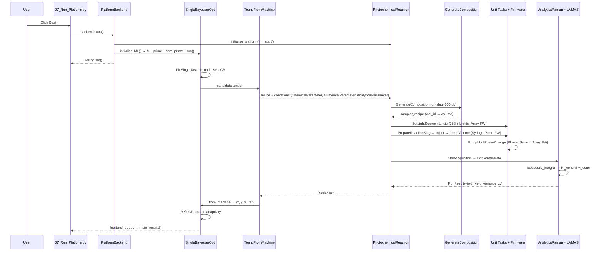

# 08 — End-to-End Walkthrough: CS1 Photoredox Campaign

This report stitches the layers of Robochem together by tracing a single Bayesian iteration of the `Examples/CS1` campaign — a photoredox catalyst/conditions screen on platform Perry — from the moment the user presses **Start** in the Streamlit UI to the moment a new `(x, y)` pair has been fed back into the GP posterior.

## 1. CS1 Session Snapshot

`Examples/CS1/session.json` defines the campaign:

- **Platform / experiment**: `"platform_name": "Perry"`, `"platform_experiment": "PhotochemicalReaction"`, `"experiment_type": "BO_optimisation"` (`session.json:4-7`).
- **Physical parameters**: `residence_time` variable 30–100000 s (`:8-16`), `light_intensity` variable 0–100 % (`:17-25`), constants `slug_volume = 600 uL` (`:26-34`) and `flowrate_sampling = 0.5 mL/min` (`:35-43`).
- **Chemical design space** (`StockDF`, `:46-64`): one SM (`"Internal_ID": SM`), five candidate catalysts (`Ru(bpy)Cl`, `Ru(bpy)PF6`, `Ir(ppy)`, `Ir(CF3)ppy`, `5CzBN`), one excess reagent (`TFAA`), two "other" reagents (`PyNO`, `4-PhPyNO`), solvent `MeCN`.
- **Analysis**: `"analysis_type": "NMR"`, target peak at `-57.94 ppm` with `simple_integration`, calibration slope `target_peak_calibration_coeff_1 = 1654.9 mM/AU` (`:457-754`). (Despite the NMR analytical tag, CS1's live readout on Perry runs through the Raman backend — see §7.)
- **ML parameters** (`:756-989`): `Limiting Reagent_ml` 100–200 mM (single-discrete "SM"); `Catalyst_ml` 0.001–0.004 eq across five discrete catalysts with a learned 3-D embedding; `Excess Reagent_ml` 0.9–3.5 eq of TFAA; `Other Reagent_ml` 0.9–3.0 eq across `[PyNO, 4-PhPyNO]` with 1-D embedding; `residence_time_ml` 120–1800 s continuous; `light_intensity_ml` 0–100 % continuous.
- **Objectives**: `["yield", "residence_time"]` with `weights = [0.9, -0.1]` (`:991-1016`).
- **BO backend** (`:995-1017`): `SingleBayesianOpti` → `SingleTaskGP` + `UCB` acquisition, `LHS` init (15 points), 50 total iterations, batch size 1, adaptive exploration (`Explorative Factor = 10.0`), `Resubmission of Failed N = 1`.
- **Vial map** (`VialDF.csv`): 17 stock/solvent/wash vials on `Sampler_cnc` + 36 sample vials on `Collector_cnc`. Relevant stocks sit in `holder_D`: `Stock_SM` at `D/A1` @ 1000 mM (`VialDF.csv:2`, `StockSolutionDF.csv:2`), `Stock_TFAA` at `D/B2` @ 3500 mM (`VialDF.csv:10`, `StockSolutionDF.csv:8`), `Stock_Irppy` at `D/C3` @ 3 mM (`VialDF.csv:13`, `StockSolutionDF.csv:5`), `Stock_PyNO` at `D/A2` @ 2000 mM (`VialDF.csv:17`, `StockSolutionDF.csv:9`).

## 2. Clicking "Start"

`pages/07_Run_Platform.py:117-122` binds the **Start** button to `backend.start` on the singleton `PlatformBackend`. That handler (`platform_backend.py:746-762`) does three things:

1. `initialise_platform()` (`:693`) instantiates `PhotochemicalReaction` via `self.platform_constructors[experiment_key]` and calls `platform_experiment.start(...)` which opens serial ports to all Arduinos, runs the optional startup cleaning, and launches the experiment's background run loop.
2. `initialise_ML()` (`:496-571`) gathers the ML-tagged parameters and constants out of `session_container`, runs `ml_experiment_class.ML_prime(...)` then `com_prime(experiment=self.platform_experiment, parameter_machine=self.parameter_machine)` (`:554-565`) to wire the BO backend to the physical coupler, then `ml_experiment_class.run()` spawns the proposer thread.
3. `self._rolling.set()` flips the shared `Event` that `07_Run_Platform.py:137` polls to swap the UI into live-results mode (`main_results()`, `save_periodically()`).

## 3. The BO Backend Proposes

Because `session.json` names `SingleBayesianOpti`, `ml_backends.py:850` resolves to `SingleBayesianOpti(ML_Platform_omni, SingleBayesianOptiBackend)`. With 15 LHS seed points complete, iteration #16 enters BO mode: the backend fits a `SingleTaskGP` on `(x_normalized, y_weighted)` for the two weighted objectives, builds a `UCB` acquisition with `beta` scaled by the adaptive explorative factor (`Explorative Factor = 10.0`, thresholds `0.05/0.8`, counter `3`) and optimises it over the mixed space:

- 1 continuous dim for `residence_time`
- 1 continuous dim for `light_intensity`
- 1 continuous dim for `[SM]`
- 1 continuous + 3-D embedding for catalyst choice
- 1 continuous for `[TFAA]`
- 1 continuous + 1-D embedding for `PyNO/4-PhPyNO` choice

The optimiser emits a single candidate `tensor` which is handed to `ToandFromMachine._to_machine` (`ml_backends.py:47-250`). Each `ML_parameter` is inverse-transformed: `back_translation_continuous` returns unitful floats (e.g. 1450 s, 75 %, 150 mM, 2.1 eq) while `back_translation_discrete` on the catalyst and "other reagent" embeddings picks the nearest discrete label (e.g. `Ir(ppy)`, `PyNO`). The output is a list of typed parameters — `ChemicalParameter(name="Ir(ppy)", value=0.00225, units="eq", foreign_key="Catalyst")`, `NumericalParameter(name="residence_time", value=1450, units="S")`, etc. — with `sampling_priority` tags pulled from `_sampling_priorities` (`:53-73`, e.g. `Limiting Reagent → 50000`, `Catalyst → 10000`). Analytical constants (`target_peak = -57.94 ppm`, `yield_calculation_chemical = "SM"`) are appended from `constants` (`:186-250`). The resulting recipe+conditions bundle is pushed into the `platform_experiment` run queue.

## 4. Recipe Construction — a Concrete CS1 Slug

Inside the experiment thread, `ChemicalReaction._procedure_experiment` (`chemistry.py:716-724`) calls `GenerateComposition.run(platform, experiment_recipe, slug_volume=600.0 uL, sampler_name="Sampler_cnc")` (`liquid_handler_sampling.py:1069-1144`). The task walks `platform.samples` (seeded from `VialDF.csv`) and for each `RecipeComponent` picks the least-full `Stock` vial whose `Conc_<name>` column has the compound, then solves `C_stock * V_extract = C_target * 600 uL` per ingredient.

For the candidate above (`[SM]=150 mM`, `[TFAA]=2.4·150=360 mM`, `[Ir(ppy)]=0.00225·150=0.338 mM`, `[PyNO]=2.1·150=315 mM`, MeCN to balance), and using the CS1 stocks from `StockSolutionDF.csv`:

| Component | Stock (conc) | Vial (Sampler/Holder/Pos) | Volume (µL) |
|---|---|---|---|
| SM @ 150 mM | Stock_SM (1000 mM) | Sampler_cnc/holder_D/A1 | 90.0 |
| TFAA @ 360 mM | Stock_TFAA (3500 mM) | Sampler_cnc/holder_D/B2 | 61.7 |
| Ir(ppy) @ 0.338 mM | Stock_Irppy (3 mM) | Sampler_cnc/holder_D/C3 | 67.6 |
| PyNO @ 315 mM | Stock_PyNO (2000 mM) | Sampler_cnc/holder_D/A2 | 94.5 |
| MeCN solvent | sol_MeCN_1 | Sampler_cnc/holder_F/B1 | 286.2 |
| **Slug total** | | | **600.0** |

`GenerateComposition` returns `(sampler_recipe: list[VialRecipeComponent], recipe)`; `OrderRecipe.run` (`photochemistry.py:231-233`) then orders the list by `sampling_priority` (SM first, other reagent next, excess, catalyst, solvent last).

## 5. Physical Execution — One Slug on Perry

Photochemistry triggers `_reactor_prepare` (`photochemistry.py:111-125`) before the slug leaves the sampler, invoking `SetLightSourceIntensity.run(source=uflow_kessil, intensity=75)` (rounded to the nearest 25 %) via `unit_tasks/reactor/light.py:13-22`. The `ChemicalReaction` parent then walks the slug through (`chemistry.py:742-849`):

- **Gas dry + tail bubble** — `MixSlugSampler.run(sampler=Sampler_cnc, amplitude=..., flowrate=gas_purging_flowrate, cycles=gas_purging_cycles, margin_bottom=slug_tail_bubble_volume)` (`chemistry.py:745`, `liquid_handler_sampling.py:2674`).
- **Empty sampler syringe** — `FillPump.run(pump=sampler_pump, fill=False)` (`driving_pumps.py:367`).
- **Aspirate ingredients into sampling loop** — `PrepareReactionSlug.run(platform, recipe=sampler_recipe, sampling_flowrate=0.5 mL/min, bubble_between_components=...)` visits each vial in priority order, moving `Sampler_cnc` Cartesian head over `holder_D/A1`, `D/A2`, `D/B2`, `D/C3`, `holder_F/B1` and withdrawing the 90/94.5/61.7/67.6/286.2 µL computed above (`chemistry.py:783-793`, `liquid_handler_sampling.py:2366-2378`).
- **Pre-injection mix** — `MixSlugSampler.run(...)` at `mix_before_injection_flowrate` for `mix_before_injection_cycles` (`chemistry.py:799-811`).
- **Refill and inject** — `FillPump.run(fill=True)` (`driving_pumps.py:367`) then `Inject.run(sampler=Sampler_cnc, injection_port_name="injection_flow", volume=slug+head+tail+port, flowrate=flowrate_injection, sampling_pump=sampler_pump, retract=True)` (`chemistry.py:836-848`, `liquid_handler_sampling.py:2001`).
- **Push to mixing chamber + in-reactor mix** — `PumpVolume.run(pump=main_pump, volume=injection_to_mixing_volume, flowrate=flowrate_delivery)` (`driving_pumps.py:490-536`), then optional `MixSlug.run(pump=main_pump, amplitude, flowrate, cycles)` (`driving_pumps.py:721-731`).
- **Drive through the photoreactor at the BO residence time** — `PumpVolume.run(pump=main_pump, volume=reactor_volume, flowrate=reactor_volume / residence_time)`. Kessil remains at 75 % for the full pass.
- **Phase-sensor gate at reactor exit** — `PumpUntilPhaseChange.run(pump=main_pump, sensor=phase_sensor_out, flowrate=flowrate_slug_check, ...)` (`sensing/phase_sensors.py:303-415`) advances until the leading bubble is detected, ensuring the slug front arrives at the measurement cell before Raman fires.
- **Raman acquisition** — `SetRamanParameters.run(...)`, `StartAcquisition.run(spectrometer=rama_berry)`, wait `integration_time × n_averages + delay`, `StopAcquisition.run(...)`, `GetRamanData.run(...)` (`measuring/raman_spec.py:38,86,104,122`). The result goes into `RunResult` and a fraction is collected to the Collector vial via `PumpSample.run(...)` (`liquid_handler_sampling.py:1636-1662`).
- **Reactor standby** — `SetLightSourceIntensity.run(source=uflow_kessil, intensity=0)` (`photochemistry.py:150`).

## 6. Wire-Level Handoffs

- **Pump strokes** (`FillPump`, `PumpVolume`, `MixSlug`, `PumpSample`, `Inject`): the `liquid_handler_sampler` / `main_pump` drivers serialise G-code-style motion commands over USB-serial to the Trinamic/AccelStepper sketch in `Devices/Syringe Pump/Firmware/syringe_pump_nrg/` which drives the lead-screw stepper and reads the home/end endstops.
- **`SetLightSourceIntensity`**: the `Light_Array` device writes a PWM duty (0/25/50/75/100 %) to `Devices/Photochemical Reactor Controller/Firmware/Lights_Array/` which controls the Kessil uFlow driver and simultaneously exposes a current sense line that `ContinuousMonitoring` polls every 30 s (`photochemistry.py:97-109`).
- **`PumpUntilPhaseChange` / `MonitorPhase`**: `FC_cnc`'s optical phase-sensor bank is implemented by `Devices/Phase Sensor Controller/Firmware/Phase_Sensor_Array/`, which streams per-channel intensity readings that `sensing/phase_sensors.py:415` polls in a tight loop while commanding the pump step.

## 7. Measurement → LAMAS → BO Feedback

`AnalyticsRaman.analyse` (`raman_analysis.py:222-292`) sets spectrometer parameters, calls `_spectrometer_run` (talks to the Raman host script in `Devices/Raman Spectrometer/Spectrometer Control/`), then hands the acquired spectrum to `_process_analytics` (`:453-488`). The configured `processing_function` (`isosbestic_integral`) is the LAMAS peak-resolver: it deconvolves the SM and product bands around the isosbestic point and returns `{PI_conc, SM_conc, PI_area, SM_area, PI_var, SM_var}`. `_make_results` (`:490-651`) sets `yield = pi_conc` (i.e. product concentration against the recipe's SM ref; `:560`), attaches `yield_variance`, and returns a `RunResult`.

Control hops back to the ML side: `ToandFromMachine._from_machine(results)` (`ml_backends.py:276-355`) unpacks `results.result` → metrics dict, zips the target vector `y = [yield, residence_time]` and `y_var`, and walks `results.parameters` to rebuild the `x` tensor using `translation_continuous` / `translation_discrete` for each `ML_parameter`. The `(run_index, x, y, y_var, vial_idx, save_file_name)` tuple is appended to the BO backend's training set, the GP posterior is refit with the new point, and the adaptivity counter ticks — if the last three UCB improvements stayed below `adaptive_threshold_exploration = 0.05`, the explorative factor dilates on the next proposal. The frontend observes the new row via `frontend_queue` and `main_results()` redraws the hypervolume and objectives plots.

## Sequence Diagram

---

**Summary**: CS1's `session.json` declares a 6-parameter UCB Bayesian loop on Perry with weighted objectives `[yield 0.9, residence_time -0.1]`; pressing Start chains `initialise_platform → initialise_ML → _rolling.set`, after which `SingleBayesianOpti` proposes a tensor that `ToandFromMachine._to_machine` renders into a typed recipe, `GenerateComposition` converts into per-vial µL volumes against the CS1 stock and vial CSVs, and the photochemistry experiment drives the slug through ordered sampler, pump, light, phase-sensor and Raman unit tasks (each backed by a specific Arduino firmware in `Devices/`). `AnalyticsRaman.analyse` runs the LAMAS `isosbestic_integral` processor, yielding `(PI_conc, SM_conc, variances)` that become the `yield` scalar, which `_from_machine` converts into `(x, y)` and feeds back into the GP posterior for the next iteration.
